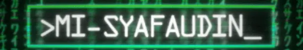
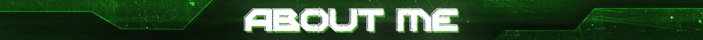

<div align="center">

  <!-- Banner Asset -->
  

  
  <br /><br />

  <!-- Typing Animation -->
  <a href="https://git.io/typing-svg">
    
  </a>

  <br /><br />

  <!-- Subtitle Badges -->
  <p align="center">
    <code><b>🐍 Python Developer</b></code> &nbsp;•&nbsp; 
    <code><b>🌐 Web Developer</b></code> &nbsp;•&nbsp; 
    <code><b>🐧 Linux Enthusiast</b></code> &nbsp;•&nbsp; 
    <code><b>📡 Network Enthusiast</b></code>
  </p>

</div>

<br />

---

 


<table border="0" width="100%" cellspacing="0" cellpadding="0">
  <tr>
    <td width="65%" valign="top">
      <p>
        Halo! Saya <b>Muhammad Ilham Syafaudin</b>, seorang developer yang berfokus pada pengembangan perangkat lunak dan infrastruktur teknologi dengan minat utama pada <b>Python</b>, <b>Web Engineering</b>, <b>Linux Systems</b>, dan <b>Computer Networking</b>.
      </p>
      <p><b>📌 Data & Latar Belakang:</b></p>
      <ul>
        <li>📍 <b>Domisili:</b> Gresik, Jawa Timur <i>(Kelahiran Bojonegoro)</i></li>
        <li>🎓 <b>Pendidikan Formal:</b> SMK Sunan Drajat Lamongan — <i>Teknik Komputer & Jaringan (TKJ)</i></li>
        <li>📖 <b>Pendidikan Non-Formal:</b>
          <ul>
            <li>Madrasatul Qur'an</li>
            <li>Madrasah Diniyah</li>
            <li>Lembaga Pengembangan Bahasa Asing</li>
            <li>Pengajian Kitab Salaf</li>
          </ul>
        </li>
        <li>💡 <b>Minat Utama:</b> Tertarik pada bahasa pemrograman Python karena sintaksnya yang bersih, mudah dipahami, dan intuitif, serta eksplorasi mendalam di dunia Linux dan Networking.</li>
      </ul>
    </td>
    <td width="35%" align="center" valign="middle">
      
    </td>
  </tr>
</table>
<hr border="solid">
<br>
 
<br>
<br>
<p align="center">
  
  
  
</p>
<br />
<hr border="solid">
<br>
 


> *"Setiap baris kode dan konfigurasi adalah langkah pembelajaran menuju penguasaan teknologi."*

```text
┌── 🎒 Kelas 6 SD
│   └── Mulai tertarik dan mengagumi dunia komputer.
│
├── 🏫 Masa SMK (TKJ)
│   └── Mempelajari dasar HTML & fondasi Teknik Komputer & Jaringan.
│
├── 🏆 Pengalaman & Kompetisi
│   ├── Peserta Lomba Blog tingkat Kecamatan Paciran.
│   └── Peserta Kompetisi Siswa SMK (LKS) tingkat Kabupaten Lamongan bidang IT.
│
└── 🚀 Fokus Saat Ini
    └── Memperdalam Python, Web Development (Frontend & Backend), Linux, & Networking.


