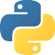

  

    

  

    

  

  

    <code><b>🐍 Python Developer</b></code> &nbsp;|&nbsp; 
    <code><b>🌐 Web Developer</b></code> &nbsp;|&nbsp; 
    <code><b>🐧 Linux Enthusiast</b></code> &nbsp;|&nbsp; 
    <code><b>📡 Network Enthusiast</b></code>
  

---

## 👨‍💻 About Me

<table border="0" width="100%">
  <tr>
    <td width="65%" valign="top">
      

        Halo! Saya <b>Muhammad Ilham Syafaudin</b>, seorang developer yang berfokus pada pengembangan perangkat lunak dan infrastruktur teknologi. Saya memiliki minat mendalam pada pemrograman <b>Python</b>, <b>Web Development</b>, pengelolaan sistem <b>Linux</b>, serta <b>Jaringan Komputer</b>.
      

      <ul>
        <li>📍 <b>Tempat Tinggal:</b> Gresik, Jawa Timur <i>(Lahir di Bojonegoro)</i></li>
        <li>🎓 <b>Pendidikan Formal:</b> SMK Sunan Drajat Lamongan — <i>Teknik Komputer & Jaringan (TKJ)</i></li>
        <li>📖 <b>Pendidikan Non-Formal:</b>
          <ul>
            <li>Madrasatul Qur'an</li>
            <li>Madrasah Diniyah</li>
            <li>Lembaga Pengembangan Bahasa Asing</li>
            <li>Pengajian Kitab Salaf</li>
          </ul>
        </li>
        <li>💡 <b>Minat Utama:</b> Bahasa pemrograman Python karena sintaksnya yang intuitif, bersih, dan mendekati bahasa manusia, serta eksplorasi mendalam di dunia Linux & Networking.</li>
      </ul>
    </td>
    <td width="35%" align="center" valign="middle">
      
    </td>
  </tr>
</table>

---

## 🗺️ My Journey

> *"Setiap langkah kecil dalam belajar adalah bagian dari perjalanan panjang menuju penguasaan teknologi."*

* <b>🌱 Kelas 6 SD:</b> Mulai mengagumi dunia komputer dan menunjukkan ketertarikan pada teknologi informasi.
* <b>💻 Masa SMK:</b> Mulai mempelajari dasar-dasar HTML serta fondasi jaringan komputer di jurusan Teknik Komputer & Jaringan.
* <b>🏆 Pengalaman & Kompetisi:</b>
  * Peserta Lomba Blog tingkat Kecamatan Paciran.
  * Peserta Kompetisi Siswa SMK (LKS) tingkat Kabupaten Lamongan di bidang IT.
* <b>🚀 Fokus Saat Ini:</b> Memperdalam pengembangan aplikasi web (Frontend & Backend) berbasis Python, mengelola sistem operasi Linux, dan mengasah keahlian Network Administration.

---

## ⚡ Tech Stack

<table border="0" width="100%">
  <tr>
    <td width="50%" valign="top" align="center">
      <h3>🌐 Front End Web Programming</h3>
      
        
      
    </td>
    <td width="50%" valign="top" align="center">
      <h3>⚙️ Back End Web Programming</h3>
      
        
      
    </td>
  </tr>
</table>

 

  <h3>🐍 Programming & Scripting Languages</h3>
  

    

  <h3>🌐 Network Administrator</h3>
  

    

  <h3>🐧 Linux Distributions & Shell</h3>
  

---

## 🛠️ Daily Drive & Tools

  

    

  

---

## 🐧 GitHub Contribution

  <picture>
    <source media="(prefers-color-scheme: dark)" srcset="https://raw.githubusercontent.com/MI-Syafaudin/MI-Syafaudin/output/pacman-contribution-graph-dark.svg">
    <source media="(prefers-color-scheme: light)" srcset="https://raw.githubusercontent.com/MI-Syafaudin/MI-Syafaudin/output/pacman-contribution-graph.svg">
    
  </picture>

---

  <h3>"Code. Learn. Build. Repeat."</h3>
  
<i>Minimalist Developer Profile • Powered by Linux & Python</i>

